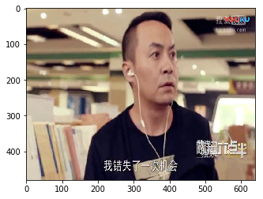
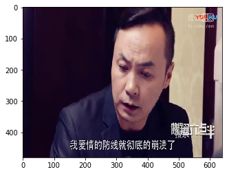

# 深度学习训练数据打标签过程

为了获取大量的图片训练数据，在采集数据的过程中常用视频的方式采集数据，但对于深度学习，训练的过程需要很多的有有标签的数据，这篇文章主要是解决视频文件转换成图片文件，并加标签，最后把数据存储到pkl文件中，为后续深度学习提供数据。

## 1. video to image

* 这个应用，主要是把视频切分成图片，并保存到本地，可以自定义切分的时间间隔；
* 在深度学习中，由于场景的需要，有时候需要自己动手去做图片的标注，但是我们在采取数据的时候，多把数据保存成视频的形式，对于视频的信息不好进行标注。对于视频转换成图片，可以通过播放视频，然后通过截图的方式把所需要的图片保存到本地，但是这样子的话，工作效率很很低。所以，为解决这个麻烦的过程，我先把视频的数据一帧一帧的读取进来，并生成成图片保存到本地，节省了大量的时间。

### 具体代码实现过程


```python
# 导入所需要的库
import cv2
import numpy as np
```


```python
# 定义保存图片函数
# image:要保存的图片名字
# addr；图片地址与相片名字的前部分
# num: 相片，名字的后缀。int 类型
def save_image(image,addr,num):
    address = addr + str(num)+ '.jpg'
    cv2.imwrite(address,image)
```


```python
# 读取视频文件
videoCapture = cv2.VideoCapture("./input/chen6.30.mp4")
# 通过摄像头的方式
# videoCapture=cv2.VideoCapture(1)
```


```python
#读帧
success, frame = videoCapture.read()
i = 0
while success :
    i = i + 1
    save_image(frame,'./output/img_',i)
    if success:
        print('save image:',i)
    success, frame = videoCapture.read()
```

    save image: 1
    save image: 2
    save image: 3
    save image: 4
    save image: 5
    save image: 6......

## 2. 对于生成的图片添加label，并保存成pkl格式
* 在这里只选择两张图片进行举例。


```python
import numpy as np
from PIL import Image
import pickle
import matplotlib.pyplot as plt
%matplotlib inline
```

### 2.1 读取图片


```python
img_640 = Image.open('./output/img_640.jpg')
img_910 = Image.open('./output/img_910.jpg')
```


```python
# 显示图片
plt.imshow(img_640)
```


    <matplotlib.image.AxesImage at 0x15ece1330b8>





### 2.2 把图片数据转换成numpy.ndarray


```python
img_640_n = np.array(img_640)
img_910_n = np.array(img_910)
```


```python
type(img_640_n)
```


    numpy.ndarray


## 2.3 对数据进行保存


```python
# 创建一个空list，用于存储图像数据因为是两张图片说以创建2个(480, 640, 3)的矩阵。
image_data = []
```


```python
# 把数据存放进来
image_data.append(img_640_n)
image_data.append(imgh_910_n)
```


```python
# 添加标签，假设这两张图片是两个类别，把他们标注为类型1和2
image_data_label = np.empty(2)

image_data_label[0] = 1
image_data_label[1] = 2
```


```python
# 把标签的类型转换成int类型,为了方便出来也把data转换成numpy.ndarray类型
image_data = np.array(image_data)
image_data_label=image_data_label.astype(np.int)
image_data_label
```


    array([1, 2])


```python
plt.imshow(image_data[1])
```


    <matplotlib.image.AxesImage at 0x15ece1845f8>





### 2.4 把数据保存到pkl文件中


```python
# 把数据合并成一个元组进行保存
train_data = (image_data,image_data_label)
```


```python
# 把数据写入pkl文件中
write_file=open('./input/train_data.pkl','wb')  
pickle.dump(train_data,write_file)  
write_file.close()
```

## 3.读取图片标签和数据


```python
# 从pkl文件中读取图片数据和标签
read_file=open('./input/train_data.pkl','rb')  

(train_data,lab_data)=pickle.load(read_file)
read_file.close() 

```


```python
# 查看读取出来的数据
train_data.shape
```


    (2, 480, 640, 3)


```python
lab_data
```


    array([1, 2])


```python
plt.imshow(train_data[0])
```


    <matplotlib.image.AxesImage at 0x15ece1daa20>


* 到这里就完成了把图片加标签后存储与读取，为后续神经网络数据的输入做准备，当我们需要数据的时候，把pkl文件加载进来就可以。
